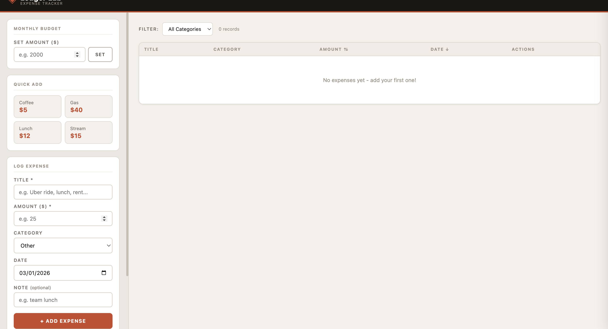

# ledger-lab

## Getting Started

Follow these steps exactly to get the app running on your local machine.

### Step 1 - Clone the Repository

```bash
git clone https://github.com/Meetp369/ledger-lab.git
```

Then navigate into the project folder:

```bash
cd ledger-lab
```

### Step 2 - Install Dependencies

```bash
npm install
```

> This installs all packages listed in `package.json`. It may take 30–60 seconds on first run.

### Step 3 - Start the Development Server

```bash
npm run dev
```

### Step 4 - Open in Browser

Open your browser and go to:

```bash
http://localhost:5173
```

The app is now running locally.

### Data resets every time I refresh the page

The app uses **React in-memory state only** - no `localStorage`, `sessionStorage`, or cookies are used. All expense data lives in component state and is cleared on refresh.

### UI


